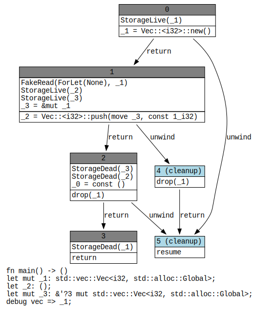

## MIR

<TwoColumns>

<template #left>

<div class="bg-[#f5f5f5] flex items-center justify-center flex-col">


</div>

<div class="text-center">

《[Introducing MIR](https://blog.rust-lang.org/2016/04/19/MIR/)》(Rust Blog, 2016)

</div>

</template>

<template #right>

* 完整 MIR Body：[`rustc_middle::mir::Body`](https://doc.rust-lang.org/nightly/nightly-rustc/rustc_middle/mir/struct.Body.html)
* 精简 MIR Body：[`rustc_public::mir::Body`](https://doc.rust-lang.org/nightly/nightly-rustc/rustc_public/mir/struct.Body.html)

<div class="text-base">

MIR = Middle-Level Intermediate Representation
([Ref](https://rustc-dev-guide.rust-lang.org/mir/index.html))

* 单态化函数实例的控制流图
* 以基本块为单位，由语句（节点）和终止符（边）构成
  * 语句：对栈上的值执行赋值、标记等操作
  * 终止符：控制流跳转(分支、调用、返回、unwind 等)
  * 没有嵌套的表达式
* 完全显式的类型和操作
* 适合各种[数据流分析](https://rustc-dev-guide.rust-lang.org/mir/dataflow.html)

</div>
</template>
</TwoColumns>

---

### MIR Body

<div class="h-6" />

<CodeblockSmallSized>
<TwoColumns>

<template #left>

```rust
pub struct Body {
    // A node in the MIR control-flow graph.
    blocks: Vec<BasicBlock>,
    // Declarations of locals within the function.
    locals: Vec<LocalDecl>,
    // The number of arguments this function takes.
    arg_count: usize,
    // Debug information of user variables, including captures.
    var_debug_info: Vec<VarDebugInfo>,
    // Mark an argument as getting passed 
    // as its individual components at the LLVM level.
    spread_arg: Option<Local>,
    // The span that covers the entire function body.
    span: Span,
}
```

<div class="text-center">

[rustc_public::mir::Body](https://doc.rust-lang.org/nightly/nightly-rustc/rustc_public/mir/struct.Body.html)

</div>

</template>

<template #right>

获取 Body 的方式

* [FnDef::body](https://doc.rust-lang.org/nightly/nightly-rustc/rustc_public/ty/struct.FnDef.html#method.body)
* [Instance::body](https://doc.rust-lang.org/nightly/nightly-rustc/rustc_public/mir/mono/struct.Instance.html#method.body)
* [CrateItem::body](https://doc.rust-lang.org/nightly/nightly-rustc/rustc_public/struct.CrateItem.html#method.body)
* [MirVisitor::visit_body](https://doc.rust-lang.org/nightly/nightly-rustc/rustc_public/mir/visit/trait.MirVisitor.html#method.visit_body)

示例：[`examples/vec-push-mir.rs`](https://github.com/os-checker/redpen/blob/main/examples/vec-push/run.sh)

<div class="flex items-center justify-between gap-4">
<div>

[Demo](https://play.rust-lang.org/?version=nightly&mode=debug&edition=2024&gist=abd4c3f618b81d9f241db11efee09b80)

</div>

<div class="flex-1">

```rust
let mut vec = Vec::new();
vec.push(1);
```

</div>

</div>
</template>
</TwoColumns>
</CodeblockSmallSized>


---

### MIR 局部变量

<div class="h-2" />

<CodeblockSmallSized>

<TwoColumns>

<template #left>

<div class="border border-orange-200 px-1">

```rust
pub struct LocalDecl {
    ty: Ty,
    span: Span,
    mutability: Mutability,
}
```

</div>
<div class="text-sm">

`Body.locals: Vec<LocalDecl>` 类似函数的栈，存放不同的值

* 第 0 个位置为返回值
* 第 `1..=arg_count` 位置为函数参数
* 剩余位置存放使用者定义的变量和临时变量

</div>

</template>

<template #right>

<div class="border border-green-200 px-1">

```rust
pub struct VarDebugInfo {
    name: Symbol,
    source_info: SourceInfo,
    composite: Option<VarDebugInfoFragment>,
    value: VarDebugInfoContents,
    argument_index: Option<u16>,
}
```

</div>

<p class="text-sm">
局部变量的名称、源码位置、类型、值、可能的函数参数位置。
</p>

</template>

</TwoColumns>

<v-click>

<TwoColumns>

<template #left>

<div class="border border-orange-200 px-1">

```rust
let mut _0: ();
let mut _1: std::vec::Vec<i32>;
let _2: ();
let mut _3: &mut std::vec::Vec<i32>;
```

</div>
</template>

<template #right>

<div class="border border-green-200 px-1">

```rust
scope 1 {
    debug vec => _1;
}
```

</div>
</template>

</TwoColumns>

<div class="text-center">Dump MIR</div>

</v-click>
</CodeblockSmallSized>

---

### MIR - Control Flow Graph - BasicBlock

<CodeblockSmallSized>

<TwoColumns>

<template #left>



</template>

<template #right>

```rust
bb0: {
    _1 = Vec::<i32>::new() -> [return: bb1, unwind continue];
}

bb1: {
    _3 = &mut _1;
    _2 = Vec::<i32>::push(move _3, const 1_i32)
          -> [return: bb2, unwind: bb4];
}

bb2: {
    drop(_1) -> [return: bb3, unwind continue];
}

bb3: { return; }

bb4 (cleanup): {
    drop(_1) -> [return: bb5, unwind terminate(cleanup)];
}

bb5 (cleanup): { resume; }
```

<div class="text-sm leading-tight">

rustc vec-push.rs -Zdump-mir=main -Zdump-mir-graphviz

dot -Tsvg mir_dump/vec_push.main.-------.renumber.0.dot -o main.svg

</div>
</template>

</TwoColumns>

</CodeblockSmallSized>

<style> p { margin: 0; } </style>

---

<CodeblockSmallSized>

<TwoColumns>

<template #left>

<div class="border border-red-400 px-1">

```rust
pub struct BasicBlock {
    statements: Vec<Statement>,
    terminator: Terminator,
}
```

</div>

```rust
pub enum StatementKind {
    Assign(Place, Rvalue),
    FakeRead(FakeReadCause, Place),
    SetDiscriminant {
        place: Place,
        variant_index: VariantIdx,
    },
    StorageLive(Local),
    StorageDead(Local),
    Retag(RetagKind, Place),
    PlaceMention(Place),
    AscribeUserType {
        place: Place,
        projections: UserTypeProjection,
        variance: Variance,
    },
    Coverage(Opaque),
    Intrinsic(NonDivergingIntrinsic),
    ConstEvalCounter,
    Nop,
}
```

</template>

<template #right>

```rust
pub enum TerminatorKind {
    Goto { target: BasicBlockIdx, },
    SwitchInt { discr: Operand, targets: SwitchTargets },
    Resume, Abort, Return, Unreachable,
    Drop { place: Place, target: BasicBlockIdx, unwind: UnwindAction },
    Call {
        func: Operand, args: Vec<Operand>, destination: Place,
        target: Option<BasicBlockIdx>, unwind: UnwindAction,
    },
    Assert {
        cond: Operand, expected: bool, msg: AssertMessage,
        target: BasicBlockIdx, unwind: UnwindAction,
    },
    InlineAsm { ... },
}
```

```rust
bb0: {
    _1 = Vec::<i32>::new() -> [return: bb1, unwind continue];
}
bb1: {
    _3 = &mut _1;
    _2 = Vec::<i32>::push(move _3, const 1_i32)
          -> [return: bb2, unwind: bb4];
}
bb2: { drop(_1) -> [return: bb3, unwind continue]; }
bb3: { return; }
```

</template>

</TwoColumns>

</CodeblockSmallSized>

---

### BasicBlock - Terminator

<CodeblockSmallSized>

```rust {2}{lines: true}
bb0: {
    _1 = Vec::<i32>::new() -> [return: bb1, unwind continue];
}
// bb0.terminator.successors() 返回 `[1]`
```

```rust {3-15}{lines: true}
BasicBlock { // bb0 (BasicBlockIdx=0)
  statements: [],
  terminator: Terminator {
    kind: Call {
      func: Constant(
        ConstOperand {
          span: Span { repr: "examples/vec-push/vec-push.rs:3:19: 3:27", },
          const_: MirConst { ty: Ty { kind: RigidTy(FnDef(
                    FnDef(DefId { id: 1, name: "std::vec::Vec::<T>::new" }),
                    GenericArgs([Type(Ty { id: 2, kind: RigidTy(Int(I32)) })]),
          ) ) } }
        }
      ),
      args: [], destination: _1, target: Some(1), unwind: Continue,
    }
  }
}
```

下一个基本块：`impl Terminator { pub fn successors(&self) -> Vec<BasicBlockIdx> }`

</CodeblockSmallSized>

---

### BasicBlock - Statement

<CodeblockSmallSized>

```rust {2-3}{lines: true}
bb1: {
    _3 = &mut _1; // Statement
    _2 = Vec::<i32>::push(move _3, const 1_i32) -> [return: bb2, unwind: bb4]; // Terminator
}
// bb1.terminator.successors() 返回 `[2, 4]`
```

```rust
BasicBlock { // bb1 (BasicBlockIdx=1)
  statements: [Statement {
    kind: Assign(_3, Ref(Region { kind: ReErased }, Mut { kind: TwoPhaseBorrow }, _1))
  }],
  terminator: Terminator { Call {
      func: { FnDef("std::vec::Vec::<T, A>::push", GenericArgs([ Int(I32), Adt("std::alloc::Global") ]) },
      args: [
        Move(_3),
        MirConst {
          kind: Allocation {
            bytes: [Some(1), Some(0), Some(0), Some(0) ], provenance, align: 4, mutability: Mut
          },
          ty: Int(I32)
        }
      ],
      destination: _2, target: Some(2), unwind: Cleanup(4)
  } }
}
```

</CodeblockSmallSized>

---

### 遍历 MIR

<CodeblockSmallSized>

```rust
pub trait MirVisitor {
    fn visit_body(&mut self, body: &Body) { ... }
    fn super_body(&mut self, body: &Body) { ... }
    fn visit_ty(&mut self, ty: &Ty) { ... }
    fn super_ty(&mut self, ty: &Ty) { ... }
    ...
}
```

</CodeblockSmallSized>

* [rustc_public::mir::visit](https://doc.rust-lang.org/nightly/nightly-rustc/rustc_public/mir/visit/index.html) 文档
* [rustc_public::mir::visit::MirVisitor](https://doc.rust-lang.org/nightly/nightly-rustc/rustc_public/mir/visit/trait.MirVisitor.html)
  * `visit_<item>` 默认调用 `super_<item>`
  * `super_<item>` 默认解构 `<item>` 的子项 `<sub_item>`，并对所有子项调用 `visit_<sub_item>`

使用方式：
* 定义一个数据结构，并实现 `MirVisitor` 来遍历 MIR 覆盖你感兴趣的目标结构 `<item>`
* 覆盖那个 `visit_<item>` 实现，并调用 `self.super_<item>` 继续在子项上遍历

示例 `traverse-mir.rs`：收集被实际执行的函数调用。

---

<CodeblockSmallSized>
<TwoColumns>

<template #left>

```rust {5-7}
fn analysis() -> ControlFlow<(), ()> {
    let mut collector = CalleeCollector::default();
    let local_crate = rustc_public::local_crate();
    for f in local_crate.fn_defs() {
        if let Some(body) = f.body() {
            collector.visit_body(&body);
        }
    }
    dbg!(&collector);
    ControlFlow::Break(())
}
```

</template>

<template #right>

```rust {3-11}
struct Callee { fn_def: FnDef, generics: GenericArgs }
struct CalleeCollector { v_callee: Vec<Callee> }
impl MirVisitor for CalleeCollector {
    fn visit_ty(&mut self, ty: &Ty, _: Location) {
        if let TyKind::RigidTy(
            RigidTy::FnDef(fn_def, generics)) = ty.kind() {
            self.v_callee.push(Callee { fn_def, generics });
        }
        self.super_ty(ty);
    }
}
```

</template>

</TwoColumns>

```bash
$ cargo run --example traverse-mir -- examples/vec-push/vec-push.rs
collector = CalleeCollector {
   v_callee: [
       Callee {
           fn_def: "std::vec::Vec::<T>::new",
           generics: [ "Int(I32)" ]
       },
       Callee {
           fn_def: "std::vec::Vec::<T, A>::push",
           generics: [ "Int(I32)", "Adt(\"std::alloc::Global\", GenericArgs([]))" ]
       }
   ]
}
```

</CodeblockSmallSized>

---

<CodeblockSmallSized>

```rust {4,8-12}
impl MirVisitor for CalleeCollector {
    fn visit_ty(&mut self, ty: &Ty, _: Location) {
        if let TyKind::RigidTy(RigidTy::FnDef(fn_def, generics)) = ty.kind() {
            let opt_instance = Instance::resolve(fn_def, &generics);

            self.v_callee.push(Callee { fn_def, generics });

            if let Ok(instance) = opt_instance
                && let Some(body) = instance.body()
            {
                self.visit_body(&body);
            }
        }
        self.super_ty(ty);
    }
}
```

```rust
callees.len() = 85
callees = [
    "std::vec::Vec::<T>::new",
    "std::vec::Vec::<T, A>::push", "std::vec::Vec::<T, A>::push_mut",
    "alloc::raw_vec::RawVec::<T, A>::grow_one", "alloc::raw_vec::RawVecInner::<A>::grow_amortized",
    "std::intrinsics::cold_path",
    "std::cmp::Ord::max", "std::cmp::PartialOrd::lt", "std::cmp::Ord::max", "std::cmp::PartialOrd::lt",
    "alloc::raw_vec::RawVecInner::<A>::finish_grow",
    ...
]
```

</CodeblockSmallSized>

<div class="relative -top-92 left-140">

* [Instance::resolve](https://doc.rust-lang.org/nightly/nightly-rustc/rustc_public/mir/mono/struct.Instance.html#method.resolve)
* [Instance::body](https://doc.rust-lang.org/nightly/nightly-rustc/rustc_public/mir/mono/struct.Instance.html#method.body)

</div>

